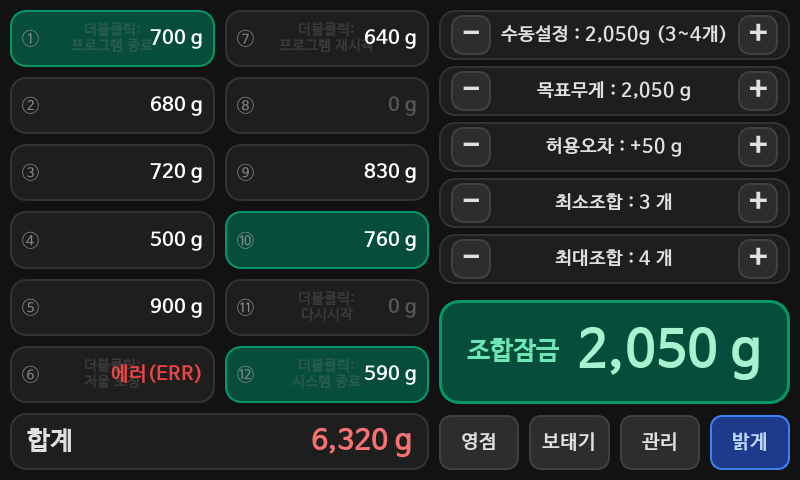
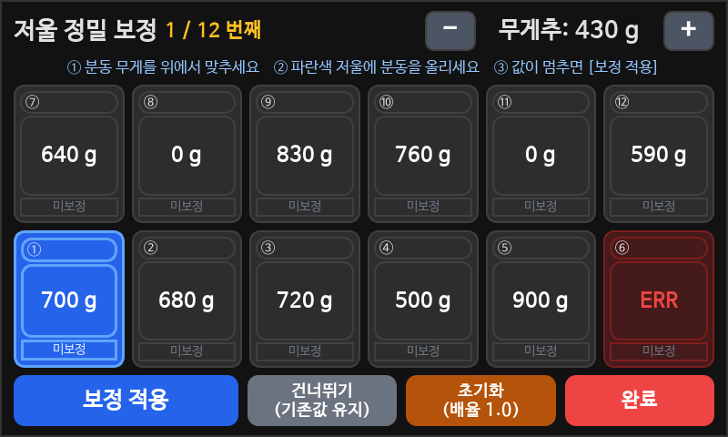
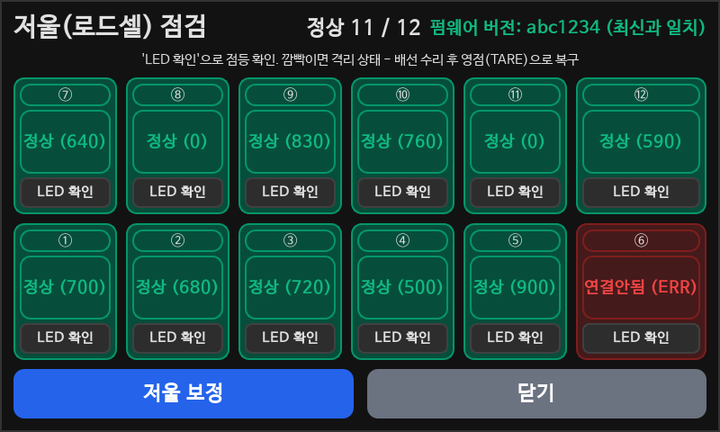

# grape-sorter

꿀송이농장 포도선별기.

라즈베리파이 + 7인치 터치스크린(800x480)에서 도는 선별 제어 프로그램입니다.
아두이노 메가 2560에 붙은 12채널 로드셀(HX711)에서 무게를 받아, 목표무게에 가장
가까운 조합을 찾아 해당 저울의 LED를 켭니다.

```
[로드셀 x12] --HX711--> [Arduino Mega 2560] --USB 시리얼 115200--> [Raspberry Pi]
                                 ^                                        |
                                 +------------ LED 점등 명령 -------------+
```

## 목적

박스 하나에 포도를 담을 때 목표무게(예: 2,050g)에 최대한 가깝게 맞춰야 하는데,
저울 12개에 흩어진 송이들 중 어떤 조합이 목표에 가장 가까운지 사람이 암산으로
고르기는 어렵습니다. 이 프로그램은 `itertools.combinations` 로 가능한 모든 조합을
전수 탐색해 최적 조합을 즉시 계산하고, 해당 저울의 LED를 켜서 작업자가 어떤
송이를 담아야 하는지 바로 알 수 있게 합니다.

현장(농장)에 무인/반무인으로 배포되는 키오스크 장비라, 개발 과정의 절반은
기능 추가보다 "전원만 넣으면 항상 정상 동작"을 보장하는 데 들어갔습니다 —
OTA 실패 자동 롤백, 시리얼 재연결, 설정 파일 원자적 저장 등 (아래 개발 기록 참고).

## 설치 (라즈베리파이)

```bash
git clone https://github.com/kjt7942/grape-sorter.git
cd grape-sorter
bash setup_kiosk.sh          # X11, PyQt5, PySerial, 자동시작, sudo 권한
sudo bash setup_boot_screen.sh   # (선택) 부팅 스플래시 화면
```

이후 `sudo raspi-config` 에서 Console Autologin 을 켜고 재부팅하면 전체화면으로 자동 실행됩니다.
자세한 절차와 트러블슈팅은 [dev_environment_spec.md](dev_environment_spec.md) 를 보세요.

## 개발 환경에서 실행

아두이노가 없으면 시뮬레이션 모드로 뜹니다. 저울 카드를 클릭해 무게를 만들고 조합 동작을 확인할 수 있습니다.

```bash
python3 main.py
```

## 파일 구성

| 파일 | 역할 |
|---|---|
| `main.py` | 시리얼 통신, 조합 연산, 설정/실적 저장, OTA |
| `main_ui.py` | PyQt5 화면 정의 (메인 + 다이얼로그 3종) |
| `arduino_firmware/` | 아두이노 메가 펌웨어 (로드셀 읽기, LED, 영점) |
| `test_sorter.py` | 조합 로직 자체 점검. PyQt5 없이 실행되며 OTA 검증 관문으로도 쓰임 |
| `tests/` | 화면·시작절차·조립단계별 테스트. [tests/README.md](tests/README.md) 참고 |
| `setup_kiosk.sh` | 라즈베리파이 키오스크 환경 구축 |
| `setup_boot_screen.sh` | 부팅 스플래시(Plymouth) 설정 |

## 실행 중 생기는 파일 (git 추적 안 함)

| 파일 | 내용 |
|---|---|
| `settings.json` | 프리셋 A~H, 저울 보정값, 마지막 설정 |
| `settings.backup.json` | 위 파일의 자동 백업 |
| `production.csv` | 박스 완성 실적 (시각, 목표/실제 무게, 사용 저울) |
| `sorter.log` | 실행 로그 (1MB 회전, 3개 보관) |

## 테스트

라즈베리파이나 아두이노 없이 개발 PC에서 전부 돕니다.

```bash
python3 tests/run_all.py         # 전체 (7개 스위트)
python3 tests/render_screens.py  # 모든 화면을 PNG 로 저장
python3 test_sorter.py           # 조합 로직만 (OTA 관문과 동일)
```

무엇을 지키는지는 [tests/README.md](tests/README.md) 에 정리돼 있습니다.

## 개발 기록

커밋 로그(`git log --reverse`) 기준. 2026-03 구간은 대부분 "Add files via
upload"로 커밋되어 있어 세부 시각별 로그로 재구성할 수 없고, 2026-08 하순부터
의미 단위 커밋 메시지로 남겼습니다.

**2026-03-14 ~ 2026-03-30 — 초기 구축**
PyQt5 UI, 시리얼 통신, 조합 연산 뼈대, 800x480 대응, 키오스크 자동시작 스크립트를
파일 업로드 방식으로 반복 커밋하며 완성.

**2026-08-29**
- 15:42 아두이노 DT/LED 핀 매핑 정리
- 16:05 OTA 시 아두이노 펌웨어 버전(git 커밋 해시)까지 검증하도록 추가
- 16:14 저울점검 다이얼로그 추가 — 12채널 상태, 채널별 LED 확인, 펌웨어 버전 비교
- 22:11 현장 무인 운영 하드닝 — OTA 실패 시 이전 커밋으로 자동 롤백, 시리얼 2초
  간격 자동 재연결, `settings.json` 원자적 저장 + 백업/복구, 시작 시 자동 영점과
  오영점 감지, `print()` 대신 회전 로그 파일
- 22:11 아두이노 — 영점 오프셋을 `[TARE]`로 보고, 커맨드 버퍼 오버플로 복구
- 22:11 `dev_environment_spec.md` / `README.md` 재작성
- 22:18 허브보드 증설·제거 시 오영점으로 오탐하던 버그 수정
- 22:35 오프스크린 테스트 스위트 추가 (하드웨어 없이 검증)
- 22:44 보태기(topup) 모드 실적 기록 버그 수정, 보정 중 LED 오작동 억제
- 22:53 라즈베리파이에 RTC가 없어 생기는 시각 오류 완화 — 미동기화 시 실적에
  "(시각미확인)" 표기

**2026-08-30**
- 14:43 저울 7번(20kg 로드셀) `calFactor` 보정
- 14:46 저울마다 로드셀 용량이 섞여 있어 보정 배율 허용범위 확대
- 14:50 보정 화면 영점대기 안내 폰트 확대
- 18:22 허브보드 3장의 SCK 라인을 각각 분리해 배선 부담 감소
- 18:55 보정 화면에서 저울 카드를 직접 탭해 해당 채널부터 보정 가능하게
- 23:25 버튼 눌림 피드백 추가, 화면 안내문구 정리

## 스크린샷

`tests/render_screens.py` 로 캡처한 실제 화면입니다 (`docs/screenshots/`).

| 메인 화면 (다크) | 저울 정밀 보정 | 저울(로드셀) 점검 |
|---|---|---|
|  |  |  |

## 트러블슈팅 · 배운 점

**오영점(bad-tare) 오탐 — 허브보드 증설/제거 시** (`88165ed`)
미배선 채널은 `performTare()`가 오프셋을 갱신하지 못해 무게가 항상 0으로 보고됩니다.
허브보드를 새로 꽂으면 그 채널이 0 → 실제 무게로 바뀌는데, 이걸 "저울에 뭔가 올려진
채 영점을 잡았다"는 오탐으로 판단했습니다. 한쪽 값이 0이면 비교를 건너뛰도록 수정.

**보태기(topup) 모드가 박스 전체가 아닌 보탠 양만 기록** (`be5b197`)
topup 모드에서 `current_target`은 "아직 부족한 양"만 담고 있어서, 2,050g 박스를
1,400g까지 채운 뒤 660g을 보탰다면 실적에는 "목표 650 / 실제 660"으로 남고 화면
표시(2,060g)와 어긋났습니다. 잠긴 조합 옆에 박스 전체 무게를 함께 기록하도록 수정.

**RTC 없는 라즈베리파이의 시각 오류** (`30803c5`)
Pi 3B는 RTC가 없어 부팅 시 `fake-hwclock`이 마지막 종료 시각을 복원합니다. 며칠
전 시각이 그럴듯하게 나오기 때문에 연도만 확인하는 방식으로는 걸러지지 않습니다.
`systemd-timesyncd`에게 실제 동기화 여부를 물어, 미확인 상태면 실적에
"(시각미확인)"을 붙입니다. 근본 해결은 아래 향후 계획 참고.

**혼합 용량 로드셀에서 보정이 항상 실패** (`58ba6ca`, `6359618`)
저울마다 5/10/20kg 로드셀이 섞여 있고 부품 수급에 따라 조합이 바뀌는데, 보정
배율 허용범위(0.5~2.0x)가 동일 용량 내 오차만 커버해서 20kg 셀이 꽂힌 저울은
매번 리젝됐습니다. 허용범위를 넓혀 현장에서 화면으로 재보정 가능하게 했습니다.

**저울점검의 수동 LED가 조합 LED에 묻힘** (`d7c7fa2`)
저울점검 화면에서 특정 채널 LED를 켜도, 조합 연산 루프가 초당 ~10회 같은 LED
명령을 계속 내보내며 100ms 안에 덮어써서 기능이 무력했습니다. 선택된 조합이
바뀔 때만 LED 명령을 보내도록 고쳐서 해결.

## 향후 계획

- **RTC 모듈(DS3231) 추가** — 현재는 시각 미동기화를 감지해 표기만 할 뿐,
  근본적으로 정확한 시각을 확보하진 못합니다 (`30803c5` 커밋 메시지에 명시).
- **OTA 신뢰 경계 강화** — OTA는 원격 저장소의 코드를 검증 없이 실행하고
  펌웨어까지 자동으로 굽습니다. 저장소 쓰기 권한 최소화와 2단계 인증은
  운영 프로세스로 남아 있고, 코드 서명 등 기술적 검증은 아직 없습니다
  (`dev_environment_spec.md` 6장).
  HTTPS+PAT 자격증명은 라즈베리파이에 평문(`~/.git-credentials`)으로 남으므로
  읽기 전용 자격증명 사용과 기기 분실 시 즉시 폐기가 필요합니다.
